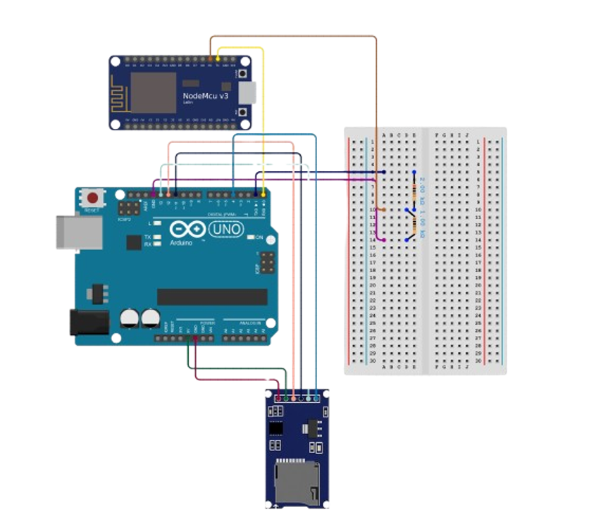
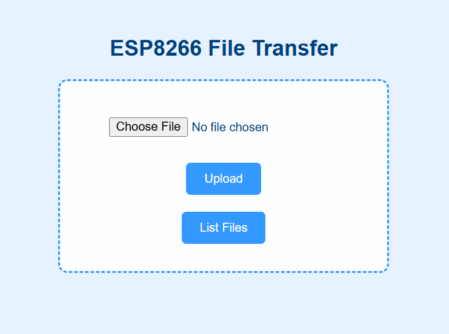
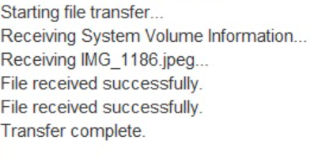
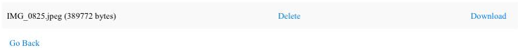

# 📂 Arduino + ESP8266 SD Card File Transfer System

A lightweight wireless file transfer solution using **Arduino Uno**, **NodeMCU (ESP8266)**, and a **micro SD card module**. Transfer files directly through a Wi-Fi web interface — no external server required.

---

## 📌 Features

- ✅ Upload files to SD card
- 📥 Download files from SD card
- 🗑️ Delete files remotely
- 📃 List all stored files
- 🌐 Simple blue-themed web UI (offline-capable)
- 🔧 Pure serial communication (no internet dependency)

---

## 🔧 Hardware Required

| Component               | Quantity |
|-------------------------|----------|
| Arduino Uno             | 1        |
| NodeMCU ESP8266         | 1        |
| Micro SD Card Module    | 1        |
| 1kΩ Resistors           | 2        |
| Breadboard              | 1        |
| MicroSD Card (FAT32)    | 1        |

---

## ⚡ Circuit Diagram

> 🖼️ *Image Placeholder: Replace with your actual circuit diagram*

### 📌 SD Card Module ↔ Arduino Uno

| SD Card Pin | Arduino Uno Pin |
|-------------|------------------|
| VCC         | 5V               |
| GND         | GND              |
| MISO        | 12               |
| MOSI        | 11               |
| SCK         | 13               |
| CS          | 4                |

### 🔁 Arduino Uno ↔ NodeMCU (ESP8266)

| Arduino Uno       | NodeMCU     |
|-------------------|-------------|
| TX (through 1kΩ)  | D7 (GPIO13) |
| RX                | D8 (GPIO15) |
| GND               | GND         |

---

## 🚀 Getting Started

### 🔌 Flash Arduino Uno

1. Open `arduino_sd.ino` in the Arduino IDE.
2. Go to **Tools → Board → Arduino Uno**
3. Select the correct **COM Port**
4. Click **Upload**

### 🌐 NodeMCU (ESP8266)

1. Open `nodemcu_web.ino` in the Arduino IDE.
2. Go to **Tools → Board → NodeMCU 1.0 (ESP-12E Module)**
3. Select correct **COM Port**
4. Click **Upload**

---

## 📲 Using the System

1. Power both Arduino Uno and NodeMCU via USB.
2. Connect to Wi-Fi hotspot:
   - **SSID**: `ESP_FileTransfer`
   - **Password**: `12345678`
3. Open browser and navigate to:  
   **http://192.168.4.1**
4. Use the web UI to:
   - Upload files
   - Download stored files
   - Delete files
   - View file list

---

## 🌐 Web Interface Preview

> 🖼️ *UI Image Placeholders – replace with actual screenshots*

- **Homepage UI**  
  

- **Upload Form**  
  

- **File List, Download & Delete**  
  

---

## ⚠️ Notes

- Format the microSD card to **FAT32** before inserting
- Keep filenames simple: use **8.3 format** (e.g., `file.txt`)
- Use **1kΩ resistor** between Uno TX → NodeMCU RX to avoid 5V damage
- You can only transfer **text-based files** reliably due to serial transfer

---

## 👨‍💻 Author

**Madhesh H**  
Cloud Engineer | IoT Developer | IEEE GRSS SRMIST  
[GitHub Profile](https://github.com/madddx) |
[LinkedIn Profile](https://www.linkedin.com/in/madheshh/)

---

## 📜 License

This project is licensed under the MIT License.  
See `LICENSE` for more details.

---

## 💡 Future Improvements

- 🔐 Add password protection to the web interface  
- 📦 Enable support for binary files or larger file chunks  
- 📲 Add OTA update support for NodeMCU  
- 📁 Implement folder navigation

